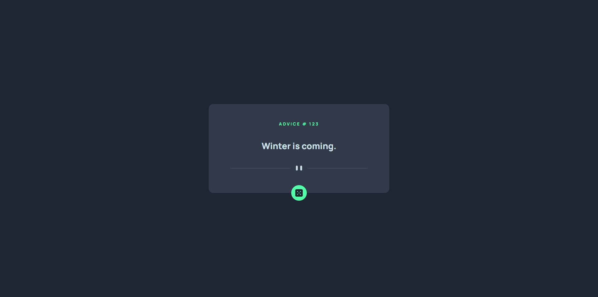

# Advice generator app

This is a solution to the [Advice generator app challenge on Frontend Mentor](https://www.frontendmentor.io/challenges/advice-generator-app-QdUG-13db). Frontend Mentor challenges help you improve your coding skills by building realistic projects.

## Table of contents

- [Overview](#overview)
  - [The challenge](#the-challenge)
  - [Screenshot](#screenshot)
  - [Links](#links)
- [My process](#my-process)
  - [Built with](#built-with)
- [Author](#author)

## Overview

### The challenge

Users should be able to get a random advice retrieved from the [Advice Slip API](https://api.adviceslip.com) when pressing the dice icon.

- ### Screenshot

### Links

- [Live Site](https://chulipinho.github.io/advice-generator/)

## My process

### Built with

- HTML5
- CSS
- Javascript

## Author

- [GitHub](github.com/chulipinho)
- [LinkedIn](https://www.linkedin.com/in/fellipe-luz-souza-machado-32aa1122a/)

## 
